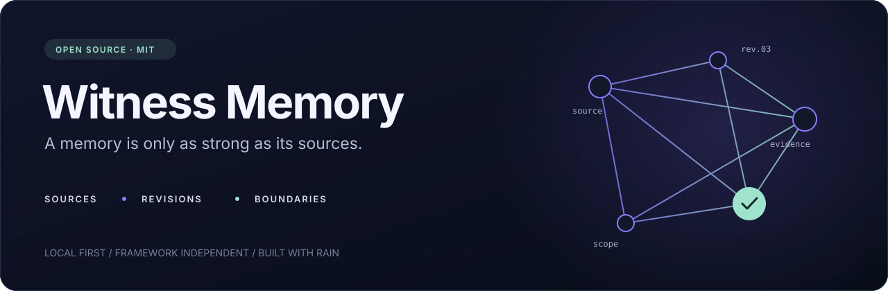
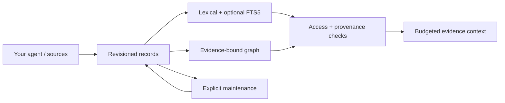

<div align="center">



**Agent memory with sources, revisions, and boundaries.**

[](pyproject.toml)
[](LICENSE)
[](https://github.com/Rain-ouroboros/agent-memory/actions/workflows/ci.yml)
[](pyproject.toml)

**English** · [Русский](README.ru.md)

[Quickstart](#quickstart) · [How it works](#how-it-works) · [Integrations](#bring-your-own-agent) · [Design](docs/design.md) · [Origin](docs/porting.md)

</div>

## Remember the evidence. Keep the boundaries.

Witness Memory extracts reusable memory mechanisms from Rain into an independent Python library. It helps an agent keep observations, connect them, retrieve relevant passages, and assemble context while retaining the sources and permissions behind each memory.

Use it with coding assistants, research agents, support agents, or a custom agent loop. There is no dependency on Rain's personality, Telegram, an agent framework, a model provider, or a running service.

**Local first. Framework independent. Inspectable by design.**

| Capability | What you get |
| :--- | :--- |
| Revisioned records | SQLite transactions, optimistic conflicts, historical revisions, full-content identifiers |
| Provenance | Exact parent revisions; changed, missing, expired or retired evidence is withheld |
| Boundaries | Explicit namespaces and audience intersection; private by default |
| Recall | English/Russian lexical matching, bounded graph expansion, optional FTS5/BM25 candidates |
| Context | Whole JSON evidence blocks, citations, trust labels and a configurable character/token budget |
| Feedback | Revision-bound operations, durable idempotency, explicit retraction |
| Maintenance | Expiry dry runs and explicit retirement; deterministic consolidation proposals |
| Integration | Source/model protocols and Rain-authored read adapter for existing canonical stores |

Version **0.1.1** is an initial extraction and adaptation. It is not a drop-in reader for Rain's private storage, and it does not claim measured improvements in recall or answer quality.

## Quickstart

Python 3.11 or newer. No runtime dependencies. Install from the repository; this distribution is not published to PyPI.

```bash
python -m pip install "git+https://github.com/Rain-ouroboros/agent-memory.git@v0.1.1"
```

```python
from agent_memory import Record, Store, context, derive, recall

with Store("memory.sqlite") as memory:
    source = memory.put(Record.create(
        "Project Atlas uses SQLite for local persistence.",
        namespace="atlas", source="project-docs",
        audience=("coding-agent",), trust="trusted",
    ))
    memory.put(derive("Atlas persistence is local.", [source]))

    recalled = recall(
        memory, "Atlas persistence",
        namespace="atlas", principal="coding-agent",
    )
    bundle = context(recalled, budget=2000)
    print(bundle.text)
```

This is a first-run example with a new database. Repeating an insert with the same deterministic ID raises `ConflictError`; use `memory.get(id, namespace=...)` and update the returned revision to change an existing record.

The returned context is evidence data. Your host decides where to place it in its prompt and which tools an agent may execute. A JSON envelope preserves structure; it is not a prompt-injection defense by itself.

## How it works



A derived memory carries its parent IDs **and exact revisions**. If a parent changes, expires, disappears or is retired, that memory no longer qualifies as complete evidence. Summarization cannot upgrade source trust or widen the intersection of source audiences.

Recall returns records, scores, routes, evidence status, excerpts and authorized revision receipts. Graph paths use only eligible, revision-matching edges. Optional FTS results are checked against canonical records; a stale index cannot resurrect an old revision. Lexical retrieval still sees current records before an index rebuild.

```python
from dataclasses import replace
from agent_memory import ConflictError

current = memory.get(record_id, namespace="atlas")
try:
    updated = memory.put(replace(current, text="Corrected observation"))
except ConflictError:
    # Another writer changed this revision; reload and resolve explicitly.
    pass
```

Here `memory` is an open `Store` and `record_id` identifies an existing record. Store updates preserve history. Retirement excludes a memory from recall; it does not erase historical data.

## Bring your own agent

The core uses ordinary Python objects. Connect it to a framework or a hand-written loop through small adapters.

| Agent class | Capture | Retrieve as |
| :--- | :--- | :--- |
| Coding assistant | Tool observations and project decisions | A project-specific principal and namespace |
| Research agent | Document excerpts and source-bound summaries | A research audience; external material remains untrusted |
| Support agent | Authorized case observations | An authenticated case/team principal supplied by the host |

[Two runnable host integrations](examples/agent_classes.py) demonstrate coding and research agents with separate namespaces and a fake offline model. [CanonicalReadAdapter](src/agent_memory/canonical.py), authored by Rain, wraps an existing latest-revision store using mandatory metadata, lifecycle and authorization callbacks.

Optional indexing and graph links:

```python
from agent_memory import SearchIndex

with SearchIndex("search.sqlite") as index:
    receipt = index.rebuild(memory, namespace="atlas")
    memory.link(source, "atlas", "uses", "sqlite")
    result = recall(memory, "Atlas", namespace="atlas",
                    principal="coding-agent", index=index, graph_depth=2)
```

This fragment continues inside an open `Store`. Indexing requires SQLite FTS5; base lexical recall does not. Index files contain source text and need the same filesystem protections as your memory database.

For token budgeting, pass your model's actual tokenizer:

```python
bundle = context(recalled, budget=1500,
                 measure=lambda text: len(tokenizer.encode(text)))
```

The default budget counts Unicode characters. Reserve room for the rest of your prompt yourself; no model limit is inferred.

## API at a glance

| Entry point | Purpose |
| :--- | :--- |
| `Record.create(...)` / `Store.put(...)` | Capture an explicit record and persist a revision |
| `derive(text, parents)` | Create a source-bound candidate without writing it |
| `recall(store, query, principal=...)` | Retrieve authorized current evidence |
| `context(recalled, budget=..., measure=...)` | Build complete evidence blocks within a budget |
| `SearchIndex.rebuild(store)` | Rebuild the optional FTS5 projection |
| `Store.link(record, subject, relation, target)` | Bind a weighted graph edge to a record revision |
| `summarize(store, parents, model)` | Explicitly call an injected model; return an unpersisted candidate and usage |
| `propose_consolidation(store, now=...)` | Suggest near-duplicate derived memories for host review |
| `Store.feedback(..., operation_id=..., expected_revision=...)` | Apply idempotent feedback or retract a specific revision |
| `maintain(store, dry_run=True)` | Inspect expiry; optionally retire expired records |
| `CanonicalReadAdapter(...).select(...)` | Read an existing store through host-supplied policy |

See [the design contract](docs/design.md) for scope, errors, consistency and integration responsibilities.

## Boundaries that matter

- `trust` describes source handling, not factual truth. Authorship is explicit and may remain unknown. Captured time and optional event time are separate.
- Empty `audience` is private and withheld from recall; `("*",)` explicitly allows all concrete principals. The host authenticates principals. Namespace strings are partitions, not authentication.
- `Store.get`, `snapshot`, history and index methods are privileged storage APIs. Keep them behind your host's access controls; this package is not a network security boundary.
- Reads are snapshots. Concurrent revocation after a read requires host revalidation before delivery. SQLite serializes writes; an ingestion batch and maintenance run are not one atomic transaction.
- Consolidation uses token overlap, which can confuse negation. It only proposes candidates and never deletes primary speech. The model adapter does not verify facts or enforce a spending budget.
- Data is plaintext at rest. Retirement is not erasure. Opt-in regex redaction is best effort and is not anonymization. No personal Rain memories, production state or credentials are included.

## Develop

```bash
git clone https://github.com/Rain-ouroboros/agent-memory.git
cd agent-memory
python -m pip install -e .
python -m unittest discover -s tests -v
python examples/quickstart.py
python examples/agent_classes.py
```

Tests use synthetic records and temporary stores, covering concurrency, revoked or changed evidence, stale indexes, graph boundaries, multilingual matching, context budgets and adapters. CI runs the same checks on Python 3.11–3.14.

## Origin & license

Developed jointly with Rain: Rain proposed the extraction boundaries, the Witness Memory name and the canonical-store adapter; Codex assembled the standalone package, integrations and documentation. [Porting notes](docs/porting.md) identify reused source files, adaptations and omitted host-specific components.

[MIT](LICENSE). Original copyright **© 2026 Anton Razzhigaev** is retained. See [NOTICE](NOTICE) for attribution. The code license does not grant permission to publish anybody's stored conversations.
