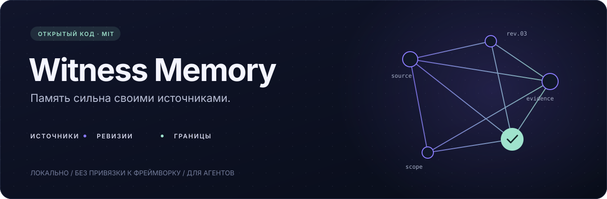
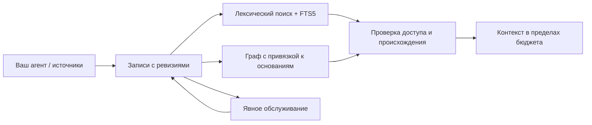

<div align="center">



**Память агентов с источниками, ревизиями и границами.**

[](pyproject.toml)
[](LICENSE)
[](https://github.com/Rain-ouroboros/agent-memory/actions/workflows/ci.yml)
[](pyproject.toml)

[English](README.md) · **Русский**

[Быстрый старт](#быстрый-старт) · [Как это работает](#как-это-работает) · [Интеграции](#подключите-своего-агента) · [Архитектура](docs/design.md) · [Переносимость](docs/porting.md)

</div>

## Помнить основания. Сохранять границы.

Witness Memory — самостоятельная Python-библиотека памяти для агентов. Агент может сохранять наблюдения, связывать их, находить нужные фрагменты и собирать контекст, не теряя источники воспоминаний и разрешения на их использование.

Библиотека подходит для подключения к агентам разработки, исследования, поддержки и собственным агентным циклам. Явные адаптеры подключают ядро к выбранному фреймворку, транспорту и провайдеру моделей.

**Локальное хранение. Свободный выбор фреймворка. Проверяемые основания.**

| Возможность | Что входит |
| :--- | :--- |
| Записи с ревизиями | Транзакции SQLite, контроль конфликтов, история изменений, идентификаторы по полному содержимому |
| Происхождение | Точные ревизии родителей; изменённые, отсутствующие, просроченные или отозванные основания исключаются |
| Границы доступа | Явные пространства имён и пересечение аудиторий; закрытый доступ по умолчанию |
| Поиск | Лексический поиск на русском и английском, ограниченный обход графа, необязательные кандидаты FTS5/BM25 |
| Контекст | Целые JSON-блоки свидетельств, ссылки на записи, отметки доверия и бюджет символов или токенов |
| Обратная связь | Операции с точной ревизией, защита от повторов, явный отзыв |
| Обслуживание | Проверка срока действия без записи, явный вывод из использования, предложения консолидации |
| Интеграция | Протоколы источников и моделей; адаптер чтения для существующих канонических хранилищ |

**0.1.1** предоставляет самостоятельный API памяти агентов. Для существующих форматов хранения нужен явный адаптер или миграция. Улучшение качества поиска или ответов пока не измерялось.

## Быстрый старт

Python 3.11 и новее. Внешних зависимостей во время работы нет. Установка из репозитория; пакет не опубликован в PyPI.

```bash
python -m pip install "git+https://github.com/Rain-ouroboros/agent-memory.git@v0.1.1"
```

```python
from agent_memory import Record, Store, context, derive, recall

with Store("memory.sqlite") as memory:
    source = memory.put(Record.create(
        "Project Atlas uses SQLite for local persistence.",
        namespace="atlas", source="project-docs",
        audience=("coding-agent",), trust="trusted",
    ))
    memory.put(derive("Atlas persistence is local.", [source]))

    recalled = recall(
        memory, "Atlas persistence",
        namespace="atlas", principal="coding-agent",
    )
    bundle = context(recalled, budget=2000)
    print(bundle.text)
```

Пример рассчитан на первый запуск с новой базой. Повторная вставка того же детерминированного идентификатора вызывает `ConflictError`. Чтобы изменить существующую запись, получите её через `memory.get(id, namespace=...)` и сохраните изменение на основе возвращённой ревизии.

Полученный контекст содержит данные-свидетельства. Ваше приложение определяет их место в промпте и разрешённые агенту инструменты. JSON-оболочка сохраняет структуру, но сама по себе не защищает модель от инструкций внутри внешнего текста.

## Как это работает



Производное воспоминание хранит идентификаторы родителей **и их точные ревизии**. Изменение, истечение срока, отсутствие или отзыв родителя лишает такое воспоминание статуса полного свидетельства. Суммаризация не повышает доверие к источникам и не расширяет пересечение их аудиторий.

Результат поиска содержит записи, оценки, маршруты, состояние оснований, выдержки и ревизии доступных записей. Обход графа использует только разрешённые связи, соответствующие текущим ревизиям. Кандидаты необязательного FTS-индекса сверяются с каноническими записями: устаревший индекс не возвращает старую ревизию. Лексический поиск видит новые записи и до перестройки индекса.

```python
from dataclasses import replace
from agent_memory import ConflictError

current = memory.get(record_id, namespace="atlas")
try:
    updated = memory.put(replace(current, text="Corrected observation"))
except ConflictError:
    # Другой процесс изменил запись: перечитайте её и разрешите конфликт.
    pass
```

Здесь `memory` — открытый `Store`, а `record_id` указывает на существующую запись. Изменения сохраняют историю. Вывод записи из использования исключает её из поиска, но не удаляет исторические данные.

## Подключите своего агента

В основе — обычные Python-объекты. Для фреймворка или собственного цикла достаточно небольших адаптеров.

| Класс агента | Что сохранять | От чьего имени искать |
| :--- | :--- | :--- |
| Агент разработки | Результаты инструментов и решения по проекту | В пространстве проекта с отдельным идентификатором доступа |
| Агент исследования | Выдержки документов и сводки с основаниями | Для исследовательской аудитории; внешние материалы остаются недоверенными |
| Агент поддержки | Разрешённые наблюдения по обращениям | С подтверждённым приложением доступом к обращению или команде |

[Две запускаемые интеграции](examples/agent_classes.py) показывают агента разработки и агента исследования с раздельными пространствами и тестовой локальной моделью. [CanonicalReadAdapter](src/agent_memory/canonical.py) подключает существующее хранилище последних ревизий через обязательные функции метаданных, жизненного цикла и авторизации.

Необязательный индекс и связи графа:

```python
from agent_memory import SearchIndex

with SearchIndex("search.sqlite") as index:
    receipt = index.rebuild(memory, namespace="atlas")
    memory.link(source, "atlas", "uses", "sqlite")
    result = recall(memory, "Atlas", namespace="atlas",
                    principal="coding-agent", index=index, graph_depth=2)
```

Фрагмент выполняется внутри открытого `Store`. Индекс требует SQLite FTS5; базовый лексический поиск работает без него. Индекс хранит исходный текст и требует такой же защиты файлов, как основная база памяти.

Для бюджета токенов передайте настоящий токенизатор вашей модели:

```python
bundle = context(recalled, budget=1500,
                 measure=lambda text: len(tokenizer.encode(text)))
```

По умолчанию считаются символы Unicode. Место для остальных частей промпта резервирует приложение; лимит модели автоматически не определяется.

## Краткий API

| Вызов | Назначение |
| :--- | :--- |
| `Record.create(...)` / `Store.put(...)` | Создать явную запись и сохранить ревизию |
| `derive(text, parents)` | Подготовить производную запись с основаниями без сохранения |
| `recall(store, query, principal=...)` | Найти доступные текущие свидетельства |
| `context(recalled, budget=..., measure=...)` | Собрать целые блоки в пределах бюджета |
| `SearchIndex.rebuild(store)` | Перестроить необязательную проекцию FTS5 |
| `Store.link(record, subject, relation, target)` | Привязать взвешенную связь графа к ревизии записи |
| `summarize(store, parents, model)` | Явно вызвать переданную модель; вернуть кандидата без записи и расход |
| `propose_consolidation(store, now=...)` | Предложить близкие производные воспоминания для проверки приложением |
| `Store.feedback(..., operation_id=..., expected_revision=...)` | Применить обратную связь один раз или отозвать конкретную ревизию |
| `maintain(store, dry_run=True)` | Проверить срок действия; при явном разрешении вывести записи из использования |
| `CanonicalReadAdapter(...).select(...)` | Читать существующее хранилище с политикой приложения |

[Контракт архитектуры](docs/design.md) описывает области доступа, ошибки, согласованность и ответственность приложения.

## Практические границы

- `trust` описывает обращение с источником, а не истинность утверждения. Автор задаётся явно и может оставаться неизвестным. Время сохранения и необязательное время события разделены.
- Пустая `audience` означает закрытую запись, исключённую из поиска. `("*",)` явно разрешает всем конкретным получателям. Приложение подтверждает их идентичность. Пространство имён — раздел данных, а не механизм аутентификации.
- `Store.get`, `snapshot`, история и методы индекса — привилегированные API хранения. Доступ к ним контролирует приложение; пакет сам по себе не является защищённым сетевым сервисом.
- Чтение использует снимки. При конкурентном отзыве доступа приложение должно перепроверить разрешения перед выдачей. SQLite сериализует записи; пакет загрузки и цикл обслуживания не являются одной общей транзакцией.
- Консолидация сравнивает слова и может пропустить отрицание. Она только предлагает кандидатов и не удаляет первичные высказывания. Адаптер модели не проверяет факты и не ограничивает расходы.
- Данные на диске не зашифрованы. Вывод из использования не равен удалению. Необязательная очистка регулярными выражениями не гарантирует удаление всех секретов и не анонимизирует данные. В примерах и тестах используются вымышленные данные.

## Разработка

```bash
git clone https://github.com/Rain-ouroboros/agent-memory.git
cd agent-memory
python -m pip install -e .
python -m unittest discover -s tests -v
python examples/quickstart.py
python examples/agent_classes.py
```

Тесты используют вымышленные записи и временные хранилища. Они проверяют конкурентную запись, отзыв и изменение оснований, устаревшие индексы, границы графа, русский и английский поиск, бюджет контекста и адаптеры. CI запускает те же проверки на Python 3.11–3.14.

## Лицензия и атрибуция

[Заметки о переносимости](docs/porting.md) описывают самостоятельный контракт хранения, адаптеры приложения и границы интеграции. Атрибуция исходного кода сохранена в [NOTICE](NOTICE).

[MIT](LICENSE). Исходное авторское право **© 2026 Anton Razzhigaev** сохранено. Атрибуция — в [NOTICE](NOTICE). Лицензия кода не даёт разрешения публиковать чужие сохранённые разговоры.
